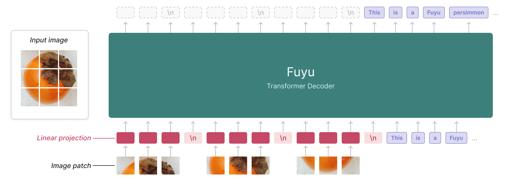
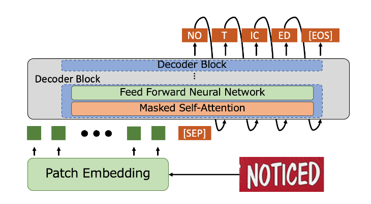

Today I Learned that the [Fuyu](https://www.adept.ai/blog/fuyu-8b) architecture
and the  best architecture for OCR recognition according to
[paperswithcode](https://paperswithcode.com/sota/optical-character-recognition-on-benchmarking)
are the same. 

The Fuyu architecture.

The DtrOCR architecture.

Both of them consist of the following steps. Chop an image into pieces, then, pass it to
a transformer decoder. 

In the case o DtrOCR the model was GPT-2 and the case o Fuyu, it was something in house.
