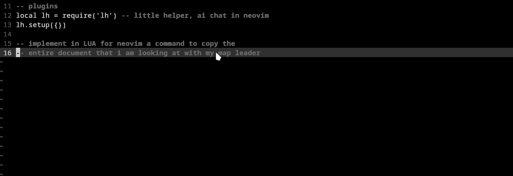

I just finished a new tiny extension for neovim for chatting with LLMs inside
of Neovim. It's a single file that I wrote with the help of Claude Sonnet 3.5
and for now it only interfaces with DeepSeek because I had a bunch of more
tokens that I currently needed.

I mainly use LLMs as a replacement for Stack Overflow. I am really done with
the process of opening a new website to just do a single simple query for
either searching it or for interfacing with an LLM.

This thing is not perfect, contrary to that! But it currently meets most of
my needs when I am programming or if I have a quick question.

If you would like to use it, the code is right in [this github repo](https://github.com/snat-s/lh.nvim)!
