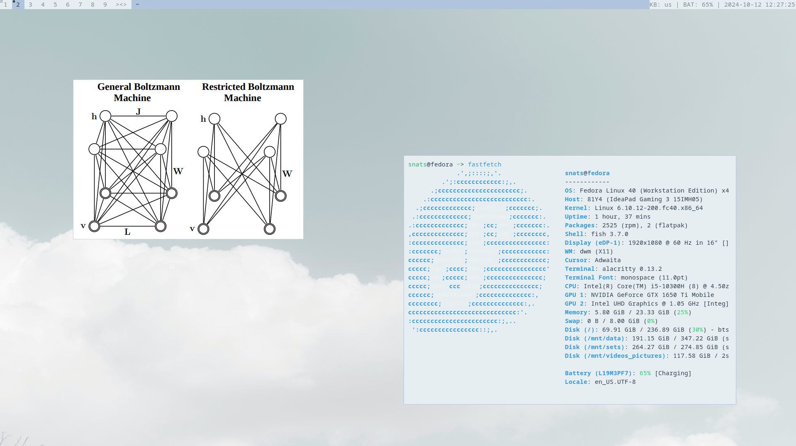

Yesterday in the afternoon, I somehow got to
[r/Unixporn](https://www.reddit.com/r/unixporn/) and felt a little nostalgic.
I wanted a little bit of customization for my desktop experience.

I haven't riced a Linux system in a long time. Instead of doing that I have been
working on personal projects. But once in a while, I like obsessing over the
aesthetics of the place I work. A little bit of beauty is good for the soul.

I decided to dedicate a single morning to it! This time around, I went with the
[suckless](https://suckless.org/) family of software. I wanted something minimal
that didn't got in my way. For this, suckless is pretty much my cup of tea. They
do their programs in C and you have to download and compile the software to
actually run it. So I grabbed a couple of repos and started my
first customization session in a long while.

## Software I downloaded / customized

1. `DWM`: as the window manager.
2. `slstatus`: for monitoring my system.
3. `dmenu`: for launching programs.
4. `alacritty`: my terminal of choice.

For all the suckless programs, you only need a single command to compile, run and
install:

```
make clean install
```

I ended up changing the color palette for `DWM`, `dmenu` and `alacritty`.

Besides that, `DWM` comes by default in a barebones state. You have to implement
a lot of things or use patches from the community. This time around, I only
installed the `gaps` patch and I created a bunch of little scripts for me. With
the help of LLMs it was a breeze! They are super useful for short bash
scripts. I created four different programs.

1. [`change_layout.sh`](https://github.com/snat-s/m/blob/main/scripts/change_layout.sh):
   Change between American and Latin American Layouts.
2. [`notify_battery_low.sh`](https://github.com/snat-s/m/blob/main/scripts/notify_battery_low.sh):
    A cronjob that tells you when you are running low on your battery.
3. [`volume.sh`](https://github.com/snat-s/m/blob/main/scripts/volume.sh): For
   increasing or decreasing volume.
4. [`brightness.sh`](https://github.com/snat-s/m/blob/main/scripts/brightness.sh):
   For increasing or decreasing brightness.

An LLM can give you so many good config defaults that it actually
impressed me. I am now in the camp that thinks that you should tailor Linux for
your own needs. It is so easy.

As always with customization, the sky's the limit. You can go down a super deep
rabbit hole to configure everything and anything in the system. But to me, It is
not worth it. I want to leverage my configs. I have a heuristic:

> "the system should feel better than the
> default, but it shouldn't take more time to setup up than what it is saving"

If anyone tells you that linux is hard, it is because they don't know how to
read. Now, with the help of LLMs it was a breeze to set up everything. I made an
entire setup that is comfy in a single morning. What is stopping you from doing
the same?

PS: The background is from this [random
image](https://unsplash.com/photos/white-clouds-on-blue-sky-UiiHVEyxtyA) that I
liked from Unsplash.
